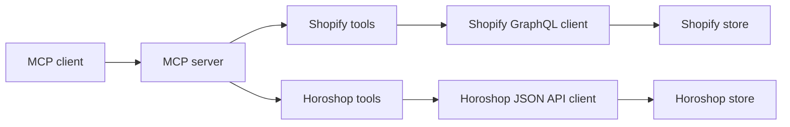

# EasyCRM MCP architecture

## Scope

One local MCP process can connect to one Shopify store, one Horoshop store, or both. Each tool belongs to exactly one platform and has a platform prefix. The first release keeps the existing Shopify capabilities and adds Horoshop product reads. Further operations are added by provider and use case.

## Module boundaries

- `src/app-config.ts` selects configured platforms and combines only their environment variables.
- `src/shopify/` owns Shopify domain validation, token exchange, GraphQL transport, and operations grouped by resource.
- `src/horoshop/` owns HTTPS origin validation, 600-second token renewal, JSON API transport, and Horoshop operations.
- `src/tools/` exposes typed MCP tools. A tool calls only its matching platform client.
- `src/cli/` configures and checks each store separately, then writes one MCP client entry.

There is no shared commerce interface yet. Shopify themes and Horoshop products have different data shapes and permissions. A common contract should be introduced only for a concrete workflow that actually needs both stores, such as a read-only stock comparison.

## Operational rules

1. Keep credentials in the local MCP client configuration. Never return a token or password through a tool result.
2. Prefix every tool with `shopify_` or `horoshop_` so the destination is clear before an agent calls it.
3. Validate store origins before making network requests. Horoshop requires an HTTPS origin; Shopify requires a `myshopify.com` domain.
4. Mark read tools as read-only and mark overwrite or replace tools as destructive.
5. Add narrow, typed operations for each API method. Do not expose an arbitrary API-call tool.
6. Page large collections. Horoshop product export accepts at most 500 records per request.
7. Test authentication, failure responses, and routing without real credentials. Verify real-store behavior separately before release.

## Next increments

1. Verify both configured stores with read-only calls, including an empty Horoshop catalog and an expired token.
2. Add provider-specific product and inventory reads, then a read-only comparison by SKU with explicit handling for missing or duplicate SKUs.
3. Add orders and customers using each platform's native fields and pagination.
4. Add narrow write tools only after defining their exact update semantics, required permissions, and a safe way to review the target store and record.
