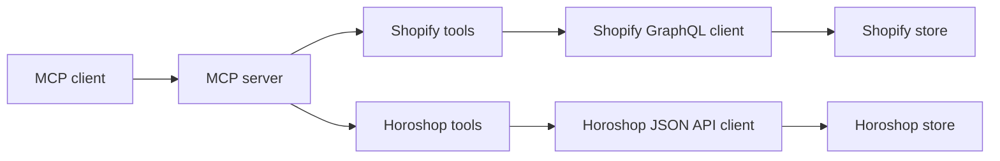

# EasyCRM MCP architecture

## Scope

One local MCP process can connect to one Shopify store, one Horoshop store, or both. Each tool belongs to exactly one platform and has a platform prefix. Resource operations are narrow and use the platform's native schema.

## Module boundaries

- `src/app-config.ts` selects configured platforms and combines only their environment variables.
- `src/shopify/` owns Shopify domain validation, token exchange, GraphQL transport, and operations grouped by theme, page, menu, product, media, variant, inventory, customer, order, fulfillment, discount, and analytics.
- `src/horoshop/` owns HTTPS origin validation, 600-second token renewal, JSON API transport, and operations grouped by product, category, customer, and order.
- `src/tools/` exposes typed MCP tools. A tool calls only its matching platform client.
- `src/cli/` configures and checks each store separately, then writes one MCP client entry.

There is no shared commerce interface yet. The providers use different IDs, fields, status models, and permissions. A common contract should be introduced for a concrete workflow that needs both stores, such as a read-only stock comparison.

## API and analytics boundaries

The Shopify client owns GraphQL transport and token refresh. Each resource module owns its query or mutation, typed input, response checks, and API error interpretation. Horoshop follows the same split with JSON POST, a cached token, and operation-specific response validation. MCP tool modules own user-facing schemas and descriptions; they do not build raw requests.

Order summaries page through accessible orders and report whether they reached the last page. They are derived metrics, not native reports. Horoshop order value is grouped by currency and uses `total_sum`, which excludes shipping. Shopify uses the current order total after returns and omits cancelled and test orders from the amount. Neither metric should be presented as settled revenue. The separate Shopify sales report uses native ShopifyQL, with a fixed metric allowlist, date range, and explicit row limit.

Purchase history is read from orders with provider-specific lookup. Shopify filters by customer ID and exposes separate cursors for orders and line items. Horoshop's documented order list has no customer filter, so it scans bounded pages and matches the delivery email. The result reports whether the scan reached the end and where to resume. Neither provider returns a combined cross-store customer identity.

Mutation responses are not treated as success solely because HTTP succeeded. Shopify `userErrors` and Horoshop `WARNING` or per-record errors fail the tool call. Async Shopify cancellation returns a job ID and a state that says processing was accepted.

Shopify reports the current live theme as `MAIN`. Theme file updates check the role immediately before mutation. A MAIN update requires an explicit confirmation flag. Theme publishing first compares the active theme ID with the ID the user reviewed, then requires a separate confirmation flag. Shopify has no atomic expected-MAIN condition, so a simultaneous publication by another actor remains possible between the check and mutation.

Product media is asynchronous. A Shopify draft product may exist while its images are still processing. Initial variant price is a second mutation, and a failure returns the created product ID so callers can repair the partial result. Horoshop image updates require an explicit append or replace mode, since the platform's default import behavior replaces existing gallery images.

## Operational rules

1. Keep credentials in the local MCP client configuration. Never return a token or password through a tool result.
2. Prefix every tool with `shopify_` or `horoshop_` so the destination is clear before an agent calls it.
3. Validate store origins before making network requests. Horoshop requires an HTTPS origin; Shopify requires a `myshopify.com` domain.
4. Mark read tools as read-only and irreversible writes as destructive. A write tool must make its replacement semantics clear in its description.
5. Add narrow, typed operations for each API method. Do not expose an arbitrary API-call tool.
6. Page large collections. Report when an aggregate stops before all pages are read. Horoshop product export accepts at most 500 records per request.
7. Treat API warnings and per-record errors as failures. Confirm mutations from their returned payloads before reporting success.
8. Test authentication, failure responses, and routing without real credentials. Verify real-store behavior separately before release.

## Next increments

1. Verify current tools against test stores, including Horoshop import responses, Shopify app scopes, pagination, and permission failures. Automated tests use mocked API responses and do not establish live-store behavior.
2. Add cross-store stock and order comparison using explicit SKU and currency rules.
3. Add Shopify order edit, refund, partial fulfillment, and advanced discount workflows as separate modules with their own permission and confirmation rules.
4. Add Horoshop customer reads and any additional order or content operations only where documented by the store's API. Do not infer endpoints from admin UI capabilities.
5. Replace Shopify's deprecated discount-node list queries when a supported replacement exposes IDs accepted by the existing discount mutations.
